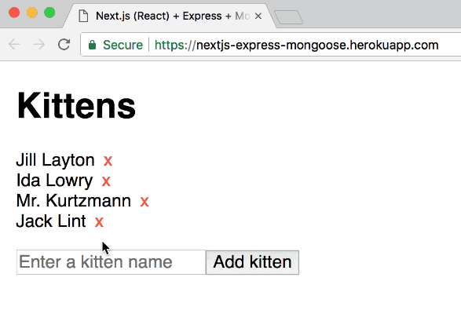

# Next.js (React) + Redux + Express REST API + MongoDB + Mongoose-Crudify boilerplate

_You want an SQL database instead of MongoDB? Check out [nextjs-sql-rest-api-boilerplate](https://github.com/tomsoderlund/nextjs-sql-rest-api-boilerplate) instead._

Based on [nextjs-express-boilerplate](https://github.com/johhansantana/nextjs-express-boilerplate), but with added [mongoose-crudify](https://github.com/ryo718/mongoose-crudify) and [redux-api](https://github.com/lexich/redux-api).

## Why is this awesome?

This is a great starting point for a any project where you want **React + Redux** (with server-side rendering, powered by [Next.js](https://github.com/zeit/next.js)) as frontend and **Express/MongoDB** as a REST API backend.
_Lightning fast, all JavaScript._

* Simple REST API routes with MongoDB database and `mongoose-crudify`.
* Redux REST support with `redux-api` and `next-redux-wrapper`.
* Flexible client-side routing with `next-routes` (see `server/routes.js`).
* Flexible configuration with `config/config.js` and `.env` file.
* Hot reloading with `nodemon`.
* Testing with Jasmine.
* Code formatting and linting with StandardJS.
* JWT authentication for client-server communication (coming).

## Demo

See [**nextjs-express-mongoose-crudify-boilerplate** running on Heroku here](https://nextjs-express-mongoose.herokuapp.com/).

## Don’t want Redux?

This project now uses Redux and [redux-api](https://github.com/lexich/redux-api). See the [no-redux](https://github.com/tomsoderlund/nextjs-express-mongoose-crudify-boilerplate/tree/no-redux) branch for the (unmaintained) version without Redux.

## How to use

Clone this repository:

	git clone https://github.com/tomsoderlund/nextjs-express-mongoose-crudify-boilerplate.git [MY_APP]

Install dependencies:

	cd [MY_APP]
	yarn  # or npm install

Start it by doing the following:

	export MONGODB_URI=*your mongodb url* // you can get one for free at https://www.mlab.com/home
	yarn dev

In production:

	yarn build
	yarn start

If you navigate to `http://localhost:3001/` you will see a [Next.js](https://github.com/zeit/next.js) page with a list of kittens (or an empty list if you haven't added one).

You have your API server running at `http://localhost:3001/api/kittens`

## Deploying

### Deploying on Heroku

	heroku create [MY_APP]
	heroku addons:add mongolab
	git push heroku master

### Deploying on Now

See instructions on [nextjs-express-boilerplate](https://github.com/johhansantana/nextjs-express-boilerplate).
